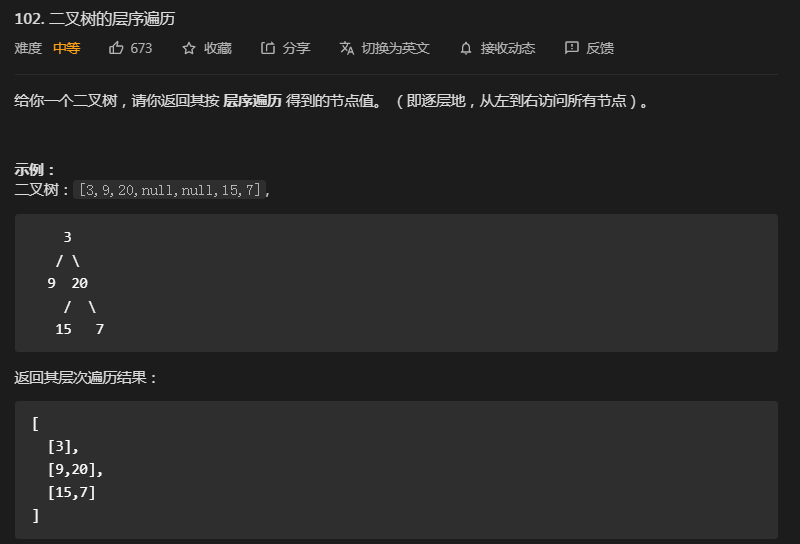
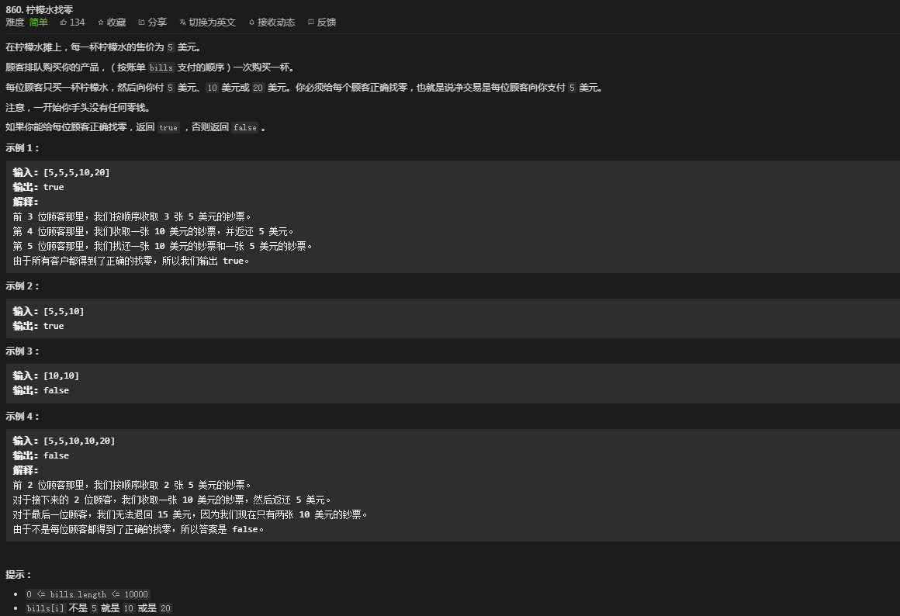
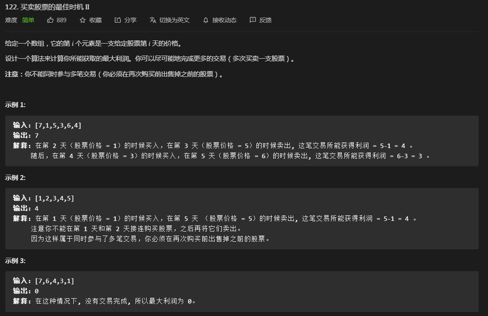

# 深度&广度优先：


## 102--二叉树的层序遍历



**思路：**

-   **广度优先搜索 BFS**

```java
// 时间复杂度 
// 空间复杂度


//  Definition for a binary tree node.
class TreeNode {
  int val;
    TreeNode left;
    TreeNode right;
    TreeNode(int x) { val = x; }
}

class Solution {
    public List<List<Integer>> levelOrder(TreeNode root) {
        List<List<Integer>> allResults=new ArrayList<>();
        if(root==null) return allResults;
        Queue<TreeNode> queue=new LinkedList<>();
        queue.add(root);
        while(!queue.isEmpty()){
            int size=queue.size();
            List<Integer> results=new ArrayList<>();
            for (int i = 0; i < size; i++) {
                TreeNode node=queue.poll();
                results.add(node.val);
                if(node.left!=null) queue.add(node.left);
                if(node.right!=null) queue.add(node.right);
            }
            allResults.add(results);
        }
        return allResults;
    }
}
```


-   **如果用DFS该如何解决？**	

    ```java
    // TODO
    ```

    


# 贪心算法：


Coin Change 特别版本：
https://leetcode-cn.com/problems/coin-change/
当硬币可选集合固定：Coins = [20, 10, 5, 1]
求最少可以几个硬币拼出总数。 比如 total = 36


**homework：**

## 860--柠檬水找零




```java
// 时间复杂度 O(n)
// 空间复杂度 O(1)
class Solution {
    public boolean lemonadeChange(int[] bills) {
        int five = 0,ten=0;
        for (int i : bills) {
            if(i==5) five++;
            else if (i==10) {five--;ten++;}
            else if(ten>0) {ten--;five--;}   // 优先选择面值大的找零
            else five-=3;
            if(five<0) return false;
        }
        return true;
    }
}
```


## 122--买卖股票的最佳时机*II*




**思路：** 

-   **暴力解法**   计算所有可能的交易组合相对应的利润，并找出他们中的最大利润。
-   **贪心算法**： 在每一步都做出当前看来最好的选择。只要今天的股价比昨天高就交易。（不是真正交易，只是为了计算）

```java
// 时间复杂度 O(n)
// 空间复杂度 O(1)

class Solution {
    public int maxProfit(int[] prices) {
        if(prices.length<2) { return 0;}
        int profit=0;  
        for (int i = 1; i < prices.length; i++) {
            int diff=prices[i]-prices[i-1];
            if(diff>0){
                profit+=diff;
            }
        // 15-17 行的等价写法： profit=Math.max(prices[i]-prices[i-1],0)
        }
        return profit;
    }
}


// 国际站解法：
class Solution{
    public int maxProfit(int[] prices){
        int i=0,buy,sell,profit=0,len=prices.length-1;
        while(i<len){
            while(i<len&&prices[i+1]<=prices[i]) i++;  // 寻找到价格上升的点
            buy=prices[i];  // 在价格上升的点处买进
            while(i<len&&prices[i+1]>prices[i]) i++;  // 寻找到价格下降的点
            sell=prices[i]; // 在价格下降处 卖出
            profit+=sell-buy;
        }
        return profit;
    }
}
```

**参考：**

https://leetcode-cn.com/problems/best-time-to-buy-and-sell-stock-ii/solution/tan-xin-suan-fa-by-liweiwei1419-2/

https://leetcode.com/problems/best-time-to-buy-and-sell-stock-ii/discuss/208241/Explanation-for-the-dummy-like-me.


