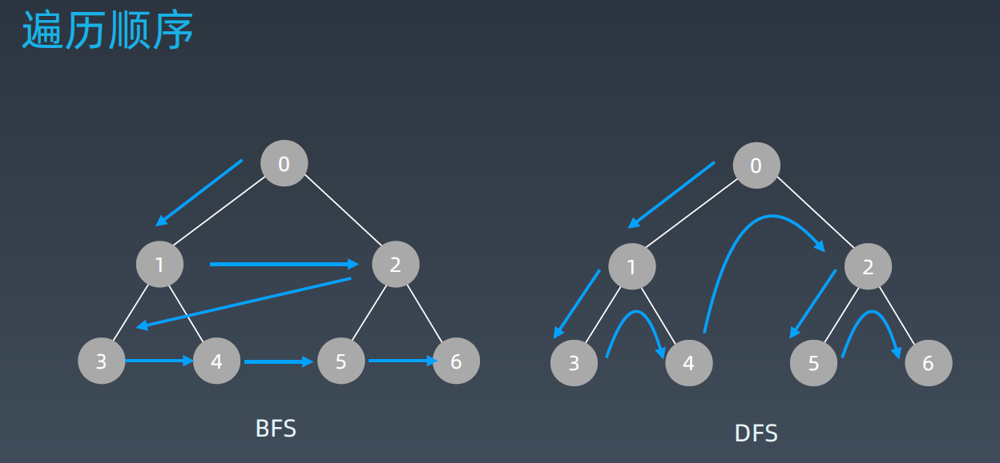
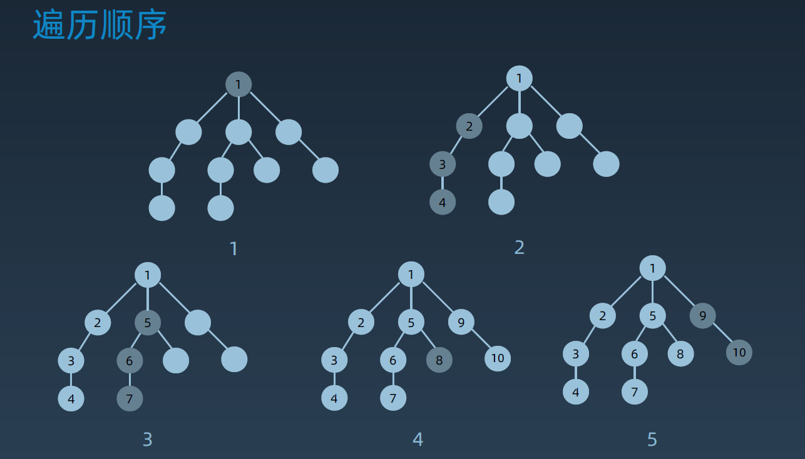
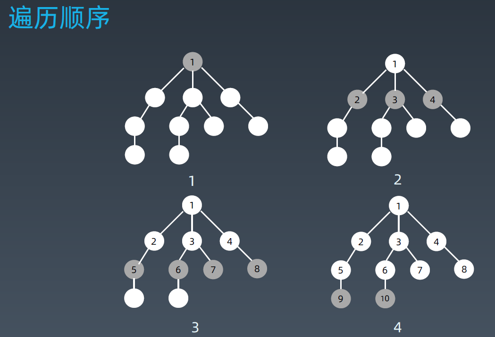

**遍历搜索**： 在树（图/状态集）中寻找特定结点。

搜索--遍历：

-   每个节点都要访问一次
-   每个节点仅仅要访问一次
-   对于节点的访问顺序不限：
    -   深度优先：Depth First Search
    -   广度优先：Breadth First Search



# 第9课 深度优先和广度优先搜索


## 深度优先搜索（DFS）

DFS最直观的例子就是“**走迷宫**”。

对于深度优先搜索，每条边最多会被访问两次，一次遍历，一次回退。

-   **时间复杂度 O(E)**
-   **空间复杂度 O(V)**

**深度优先的遍历顺序**：类似于**树的前序遍历**，是树的前序遍历的推广(可以采用**递归**和**借助栈的非递归**方式实现)。




### 代码模板

#### **递归写法：**

```Python
#Python
visited = set()     # 记录已经访问过的节点

def dfs(node, visited):
    if node in visited:   # terminator  递归终止条件： 所有节点都访问完 返回
    	# already visited 
    	return 

	visited.add(node)     # 标记已访问的节点

	# process current node here.   # 节点的处理代码
	...
    
	for next_node in node.children():  # 遍历子节点
		if next_node not in visited:   # 如果子节点没有被访问过 则执行递归遍历
			dfs(next_node, visited)
```


```java
//Java
    public List<List<Integer>> levelOrder(TreeNode root) {
        List<List<Integer>> allResults = new ArrayList<>();
        if(root==null){
            return allResults;
        }
        travel(root,0,allResults);
        return allResults;
    }


    private void travel(TreeNode root,int level,List<List<Integer>> results){
        if(results.size()==level){
            results.add(new ArrayList<>());
        }
        results.get(level).add(root.val);
        if(root.left!=null){
            travel(root.left,level+1,results);
        }
        if(root.right!=null){
            travel(root.right,level+1,results);
        }
    }
```


#### 非递归写法：

```Python
#Python
def DFS(self, tree): 

	if tree.root is None: 
		return [] 

	visited, stack = [], [tree.root]

	while stack: 
		node = stack.pop() 
		visited.add(node)

		process (node) 
		nodes = generate_related_nodes(node) 
		stack.push(nodes) 

	# other processing work 
	...
```


## 广度优先搜索（BFS）


遍历类似于树的**层次遍历**,它是树的按层遍历的推广(借助**队列非递归**方式实现)，但层序遍历和BFS的区别在于：层序遍历要求的输入结果和 BFS 是不同的。层序遍历要求我们区分每一层，也就是返回一个二维数组。而 BFS 的遍历结果是一个一维数组，无法区分每一层。

BFS中解决分层的办法： 在每一层遍历开始前，先记录队列中的节点数量n(即这一层的节点数量)，然后一口气处理完这一层的n个节点。


**算法的基本思路：**

​     a)  首先访问出发点Vi

​     b)  接着依次访问Vi的所有未被访问过的邻接点Vi1，Vi2，Vi3，…，Vit并均标记为已访问过。

​     c)  然后再按照Vi1，Vi2，… ，Vit的次序，访问每一个顶点的所有未曾访问过的顶点并均标记为 已访问过，依此类推，

​          直到图中所有和 初始出发点Vi有路径相通的顶点都被访问过为止。


BFS其实就是一种“地毯式”层层推进的搜索策略，即先查找离起始顶点最近的，然后是次近的，依次往外搜索。


**BFS的遍历顺序：**




-   **时间复杂度是 O(V+E)**，其中，V 表示顶点的个数，E 表示边的个数。
-   **空间复杂度  O(V)**


### 代码模板

```Python
# Python
def BFS(graph, start, end):
    visited = set()
	queue = [] 
	queue.append([start]) 
    
	while queue: 
		node = queue.pop() 
		visited.add(node)
        
		process(node) 
		nodes = generate_related_nodes(node) 
		queue.push(nodes)
        
	# other processing work 
	...
```


```java
//Java
public class TreeNode {     // 定义树的节点结构
    int val;
    TreeNode left;
    TreeNode right;

    TreeNode(int x) {
        val = x;
    }
}

public List<List<Integer>> levelOrder(TreeNode root) {
    List<List<Integer>> allResults = new ArrayList<>();
    if (root == null) {
        return allResults;
    }
    Queue<TreeNode> queue = new LinkedList<>();   // queue：用来存储已经被访问、但相连的顶点还没有被访问的顶点
    queue.add(root);   // 将根节点加入到队列
    while (!queue.isEmpty()) {  // 循环终止条件为 队列为空  表示所有节点遍历完毕
        int size = queue.size();
        List<Integer> results = new ArrayList<>();  // 用来记录搜索路径
        for (int i = 0; i < size; i++) {
            TreeNode node = queue.poll();  // 获取头结点的值 并将头结点出列
            results.add(node.val);
            if (node.left != null) {    // 将左节点入队
                queue.add(node.left);  
            }
            if (node.right != null) {   // 将右节点入队
                queue.add(node.right);
            }
        }
        allResults.add(results);
    }
    return allResults;
}
```


## 深度优先和广度优先搜索的应用


-   **找出社交网络中的三度友好关系**   **（app中推荐的“可能认识的人”）**

    使用广度优先搜索算法，层层往外推进。首先，遍历与起始顶点最近的一层顶点，也就是用户的一度好友，然后再遍历与用户距离的边数为 2 的顶点，也就是二度好友关系，以及与用户距离的边数为 3 的顶点，也就是三度好友关系。


------


# 第10课 贪心算法


**==贪心算法解决问题法步骤：==**

-   第一步，当我们看到这类问题的时候，首先要联想到贪心算法：**针对一组数据，我们定义了限制值和期望值，希望从中选出几个数据，在满足限制值的情况下，期望值最大。**
-   第二步，我们尝试看下这个问题是否可以用贪心算法解决：**每次选择当前情况下，在对限制值同等贡献量的情况下，对期望值贡献最大的数据**

注意： 实际上，用贪心算法解决问题的思路，并不总能给出最优解。其主要原因是，前面的选择，会影响到后面的选择。


何种情况下用到贪心算法？


## 贪心算法的应用

-   霍夫曼编码   Huffman Coding
-   Prim和Kruskal 最小生成树算法
-   Dijkstra 单元最短路径


------


# 第11课 二分查找

什么是二分查找？


代码模板

  

```Python
# Python
left, right = 0, len(array) - 1     # 界定左右边界
while left <= right:                # 循环终止条件
	  mid = (left + right) / 2      # 计算二分中位数
	  if array[mid] == target:      # 如果查找的数直接等于中位数，直接跳出循环返回结果。
		    # find the target!!    
		    break or return result 
	  elif array[mid] < target:     # 否则，查找的数在右半部分，则将左边界前移
		    left = mid + 1 
	  else: 
		    right = mid - 1         # 查找的数在左半部分，将右边界左移
```


```java
// java 
public int binarySearch(int[] array, int target) {
    int left = 0, right = array.length - 1, mid;
    while (left <= right) {
        mid = (right - left) / 2 + left;

        if (array[mid] == target) {
            return mid;
        } else if (array[mid] > target) {
            right = mid - 1;
        } else {
            left = mid + 1;
        }
    }

    return -1;
}
```


